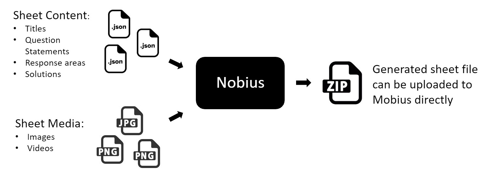

# Welcome to the Nobius docs! 🚀

Nobius is a set of utilities which generate and manage [Mobius](https://www.digitaled.com/products/assessment) content. On it's own, Mobius is a great tool for authoring content for students. However as your content base grows, you'll soon realize its limitations...

In Nobius, although it might be its primary purpose, your authored material lives separate from its form as Mobius content.

Make sure to visit our [Quickstart Guide](quickstart.md) to get started!

## Our Philosophy

As an author, your time is best spent generating and refining content, not worrying how you should style or lay it out. The separation of these two main aspects of content creation was the main idea we had in mind when making this tool. Early on, we realized that in general, all questions have a very similar structure, with parts, statements, answers and more. Following a strict structure would ensure the quality of each piece of content. However over time, we realized there is a certain degree of customization required to author effective content. This toolset finds the middle ground, offering a great degree of choice in creating content while remaining opinionated and rigid on its structure.
